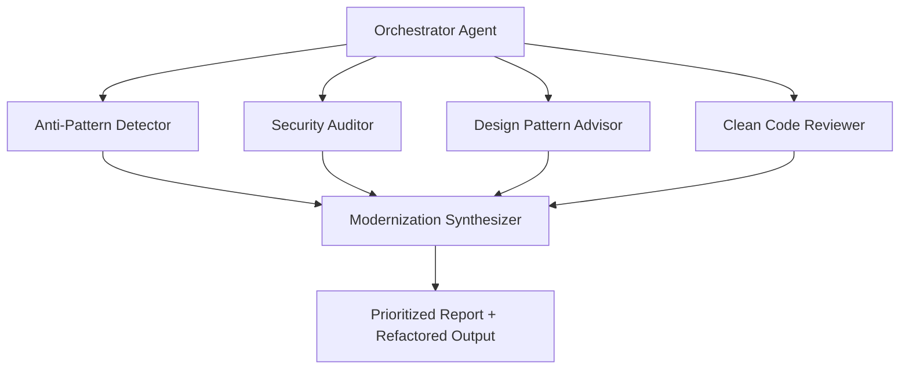

Legacy modernization is one of the hardest problems in enterprise software - not technically, but architecturally. The code is rarely the problem. The problem is making good decisions about the code under time pressure, incomplete documentation, and organizational risk aversion.

I have spent years inside that problem. Tightly coupled Java 8 services. .NET Framework applications where the original architects are long gone. Systems where no one fully understands the blast radius of a change. And I have watched the same pattern repeat: a team inherits a codebase, spends weeks trying to understand it, makes a decision based on incomplete information, and ships something that works - but carries the same structural debt forward.

That is the problem I am building to solve.

## The Architectural Challenge

Before I get to the solution, it is worth being precise about what the problem actually is. Legacy modernization fails at a few predictable points:

**Assessment is manual and inconsistent.** One engineer sees a God Class. Another sees a performance bottleneck. A third flags a security issue. Nobody has the full picture at once, and nobody is looking through the same lens.

**Decisions are made on gut feel.** "This looks like it should be a Factory pattern" is not an architectural decision - it is a guess. Without systematic analysis, you are pattern-matching on intuition.

**Security is an afterthought.** Teams audit for functionality first and security second. In legacy systems, that ordering is dangerous. OWASP vulnerabilities, hardcoded credentials, and insecure deserialization hide in plain sight for years.

**The output is a report, not a plan.** Even when teams do thorough analysis, they produce findings documents that sit in Confluence. What they need is a prioritized, actionable migration roadmap with the modernized code alongside it.

## Why a Single Agent Is the Wrong Architecture

The first design decision I made was to reject the single-agent approach.

A single agent given a legacy codebase and asked to "modernize it" will produce one of two things: a shallow surface-level pass, or an overwhelmed response that tries to fix everything at once and gets none of it right. This is not a model capability problem - it is an architecture problem. You are asking one decision-maker to hold too many concerns simultaneously.

The same is true of human teams. A single engineer asked to review a codebase for anti-patterns, security vulnerabilities, design pattern gaps, clean code violations, and modernization opportunities all at once will miss things. Not because they are not good engineers, but because those are genuinely different cognitive tasks requiring different mental frameworks.

The solution in both cases is the same: decompose the problem and assign specialized ownership.

## The Multi-Agent Design

The system I am building uses five specialized agents coordinated by an orchestrator:

Each agent owns exactly one domain. The Anti-Pattern Detector looks for God Classes, Primitive Obsession, Feature Envy, Magic Numbers. The Security Auditor runs OWASP Top 10 checks, flags hardcoded credentials, identifies SQL injection surfaces and insecure deserialization. The Design Pattern Advisor identifies where Strategy, Repository, Factory, or CQRS patterns would reduce coupling. The Clean Code Reviewer checks Single Responsibility violations, method length, naming, and dead code.

Critically, none of these agents knows what the others are finding. That isolation is intentional. Cross-contamination between agents leads to anchoring - if the Security Auditor already knows the Anti-Pattern Detector flagged a God Class, it will weight its findings toward that class rather than scanning the full surface independently.

The Synthesizer takes the independent findings, resolves conflicts, assigns priority by risk and effort, and produces two outputs: a structured report with severity-graded findings and line references, and refactored code with inline comments explaining every change.

## Why AST Parsing Matters More Than You Think

A design decision I debated early: should the agents analyze code as text, or parse it structurally?

The LLM-only approach is tempting. You feed raw source code, the model reasons about it, you get findings. It works - up to a point. The problem is precision and reliability. An LLM reading code as text will miss things that a structural analysis would catch deterministically. It will hallucinate line numbers. It will miss nested conditions that change the semantic meaning of a block.

The system uses Roslyn (Microsoft.CodeAnalysis) for C# and JavaParser for Java. Both expose Abstract Syntax Trees - the same structural representation the compiler uses to understand the code. This means the Anti-Pattern Detector knows exactly how many methods are in a class, which methods call which others, where every database query is constructed. The Security Auditor can traverse every call chain to find where user input reaches a database without sanitization.

AST parsing gives the agents ground truth about the code's structure. The LLM provides the reasoning about what that structure means and what should change. Neither is sufficient alone.

## The Stack

- **C# / .NET 9** - the language the system is built in
- **Semantic Kernel** - agent orchestration and tool calling
- **Claude API** - the reasoning layer for each agent
- **Roslyn** - C# AST parsing
- **JavaParser** - Java AST parsing
- **ASP.NET Core** - backend API
- **React + TypeScript** - frontend for code submission and results display
- **Azure** - hosting

The choice of Semantic Kernel over alternatives like LangChain or a custom orchestration layer came down to production maturity and ecosystem fit. Semantic Kernel is what Microsoft runs in their own Copilot products. For a system targeting enterprise C# codebases, the stack alignment matters.

## What I Am Not Building

Architectural clarity requires knowing what to exclude.

This is not a code formatter. It is not a linter replacement. It is not a tool for greenfield development. It targets a specific problem: the first weeks of a modernization engagement, when a team needs to understand what they have inherited and where to start. Everything in the design is optimized for that context.

It also does not make decisions autonomously. Every finding comes with an explanation. Every refactored snippet comes with a comment explaining the change. The system produces informed recommendations, not automated commits. The architect still decides.

## Where It Stands

The system is currently in active design and early development. The architecture decisions above are settled. The agent interfaces are defined. Roslyn integration is the next milestone.

I will document each major decision as I make it - including the ones that do not work out. If you are working on anything similar or have thoughts on the architecture, I would be interested to hear it.
